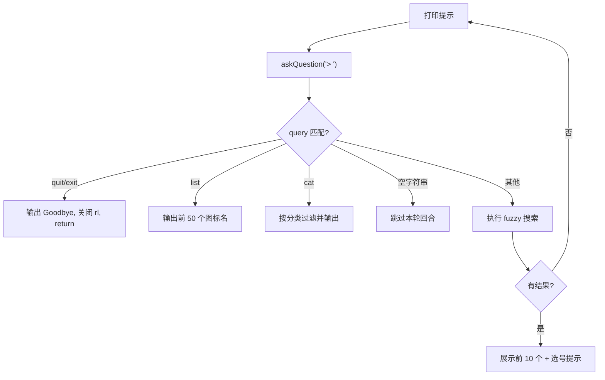

# 交互终端实现

交互模式是 licon 唯一面向"人类使用者"的入口——当用户不带子命令直接执行 `licon` 时，程序不会走 Commander.js 的命令路由，而是直接进入一个基于 `readline` 构建的循环式终端界面。这个模式的设计目标很明确：**让探索图标的体验接近 GUI 应用，而非记忆命令参数**。[来源](src/index.ts#L120-L124)

---

## 架构：共用的数据管线

在深入交互循环之前，需要理解一个关键的设计选择：**交互模式没有自己的图标数据加载模块**，它复用与 `search` 命令完全相同的元数据解析逻辑。每次启动时，它会：

1. 读取 `iconsDir` 下所有 `.json` 文件（Lucide 的元数据文件，每个图标一个）
2. 解析每个 JSON 中的 `name`、`categories` 和 `tags` 字段
3. 拼接出一个 `searchText` 字符串，供 fuzzy 库执行跨字段匹配

但与 `search.ts` 不同（后者使用模块级缓存 `cachedIconList` 避免重复读取），交互模式每次调用都会重新读取文件系统。这是因为交互模式被设计为一次性会话，而非高频调用入口。[来源](src/commands/interactive.ts#L18-L27)

```typescript
const iconList = jsonFiles.map(f => {
  const name = f.replace('.json', '');
  const meta = JSON.parse(fs.readFileSync(path.join(iconsDir, f), 'utf-8'));
  const cats = meta.categories ? meta.categories.join(', ') : '';
  const tags = meta.tags ? meta.tags.join(', ') : '';
  return { name, cats, tags, searchText: `${name} ${cats} ${tags}` };
});
```

> 使用已有的缓存机制？见 [搜索引擎实现](搜索引擎实现.md)。

---

## readline + Promise：askQuestion 的封装方式

Node.js 的 `readline.createInterface` 采用基于回调的 `rl.question(prompt, callback)` API，这与 async/await 的循环式交互不兼容。核心的适配层是一个将回调包装为 Promise 的工厂函数：

```typescript
const askQuestion = (prompt: string): Promise<string> => {
  return new Promise((resolve) => {
    rl.question(prompt, (answer) => {
      resolve(answer.trim());
    });
  });
};
```

这段代码位于 [`src/commands/interactive.ts#L29-L35`](src/commands/interactive.ts#L29-L35)，是整个交互循环的基石。关键细节是 `answer.trim()`——它发生在 Promise resolve 之前，所以在循环中消费方拿到的永远是去除了首尾空格的字符串，不需要在每个分支中重复调用 `trim()`。

这个模式在 [`setupCommand`](src/commands/setup.ts#L19-L25) 中完全复用，两者是复制而非共享——因为两个函数作用域不同，提取公共函数反而会引入不必要的间接层。

---

## 主循环的四分支调度

`while (true)` 构建了一个无限循环，每次迭代通过 `askQuestion` 等待用户输入，然后按序检查四个分支。检查顺序是**短路求值**的：一旦匹配则执行并 `continue` 回循环顶部。[来源](src/commands/interactive.ts#L37-L68)



### 1. quit/exit：退出处理

退出分支校验时不区分大小写。执行顺序是：
1. 输出告别信息
2. **关闭 `readline.Interface`**（调用 `rl.close()`）
3. 通过 `return` 跳出循环并结束函数

关闭 `rl` 是必需的，否则 Node.js 事件循环不会终止，进程会挂起。[来源](src/commands/interactive.ts#L40-L43)

### 2. list：扁平列表预览

输出前 50 个图标条目，格式为 `name [categories]`。超过 50 个时附加提示行 `"... and X more. Use search to narrow down."`。[来源](src/commands/interactive.ts#L45-L52)

注意：`list` 没有分页或翻页能力。它只是一个快速预览，完整列表应当通过 [浏览与管理](浏览与管理.md) 中的 `licon list` 命令查看。

### 3. cat <category>：按分类浏览

通过 `query.toLowerCase().startsWith('cat ')` 匹配，然后用 `query.substring(4).trim()` 提取分类名称。过滤条件是 `icon.cats.includes(category)`——这是一种**子字符串包含**匹配而非精确匹配，因为 `icon.cats` 可能是多个分类的逗号连接字符串，如 `"arrows, navigation"`。[来源](src/commands/interactive.ts#L54-L60)

如果分类名称是精确的，推荐使用专门的 [浏览与管理](浏览与管理.md) 中的 `licon cat` 命令。

### 4. 模糊搜索 + 分页 + SVG 预览

这是交互模式的核心流程，分三个阶段：

**阶段一：fuzzy 过滤**

使用 `fuzzy.filter(query, iconList, { extract: (item) => item.searchText })` 对全部图标列表执行模糊匹配。fuzzy 基于 **子序列匹配**（subsequence matching）算法，对 `searchText`（即 `"name category1, category2 tag1, tag2"`）进行全局搜索。[来源](src/commands/interactive.ts#L68-L70)

**阶段二：前 10 条分页展示**

`results.slice(0, 10)` 截取前 10 个匹配结果，使用 `1-indexed` 编号打印。这是硬编码的上限——交互模式为了保持终端可读性，没有像 [搜索图标](搜索图标.md) 命令那样提供 `--limit` 参数。[来源](src/commands/interactive.ts#L72-L75)

如果 `results.length === 0`，直接 `continue` 回循环顶部，不会进入下一阶段。

**阶段三：数字选择与 SVG 输出**

用户输入一个数字后，通过 `parseInt(selection)` 转换为整数，然后用 `num >= 1 && num <= results.length` 做边界检查。[来源](src/commands/interactive.ts#L78-L86)

有效选择会触发 SVG 读取：
1. 拼接路径 `path.join(iconsDir, \`${selectedIcon.name}.svg\`)`
2. `fs.readFileSync` 读取 SVG 原始字符串
3. 直接 `console.log(svg)` 输出到终端

注意这里**没有把 SVG 保存到文件**——交互模式的设计意图是预览而非持久化。如果需要保存，应使用 [保存与转换](保存与转换.md) 中的 `licon save` 命令。

无效输入（非数字或越界）不会产生错误消息，循环直接重新开始。这是一个**静默忽略**的设计，用户会再次看到提示，不会被错误信息打断体验。

---

## 首次运行自动跳转

当用户不带任何参数执行 `licon` 时，[`src/index.ts#L120-L124`](src/index.ts#L120-L124) 的逻辑是：

```typescript
if (process.argv.length === 2) {
  const config = getConfig();
  if (!configExists()) {
    console.log('🔧 First time setup required.\n');
    setupCommand();
  } else {
    interactiveCommand(config);
  }
}
```

交互模式函数内部也有同样的防护（[`src/commands/interactive.ts#L9-L12`](src/commands/interactive.ts#L9-L12)）：

```typescript
if (!configExists()) {
  console.log('🔧 First time setup required.\n');
  const { setupCommand } = await import('./setup.js');
  await setupCommand();
}
```

双重防护保证了即使在 `licon interactive` 子命令路径下也能触发首次引导。`setupCommand` 的 `await import()` 动态导入是为了保持函数顶部模块导入的轻量——setup 逻辑只在必要时才加载。

设置完成后，注意交互模式**不会自动退出**——它会通过 `getConfig()` 重新读取配置，然后用新配置**继续执行**。这意味用户完成 setup 后直接进入搜索循环，无需再次键入 `licon`。[来源](src/commands/interactive.ts#L14-L16)

关于 setup 的具体流程，见 [快速开始](快速开始.md)。

---

## 设计上的取舍

| 维度 | 当前实现 | 可改进方向 |
|---|---|---|
| **搜索能力** | 单次模糊搜索，每次重新全量过滤 | 可复用 `search.ts` 的缓存，或引入增量过滤 |
| **分页** | 硬编码前 10 条 | 可增加 "下一页" 命令（如 `n`）或动态分页数 |
| **SVG 预览** | 直接 `console.log` 原始 SVG | 可使用 `chalk` 加语法高亮，或控制只输出 `<svg>` 标签摘要 |
| **错误处理** | 无效输入静默忽略 | 可输出一行提示 "输入无效，请输入 1-X 之间的数字" |
| **退出路径** | `quit` / `exit` 后 `rl.close()` | 可增加 Ctrl+C 捕获（`readline` 默认已部分处理） |

这些取舍反映了交互模式的定位：**最小可行的浏览工具**，而非全功能终端 UI。复杂的交互逻辑留给各子命令，交互模式只做"提示→输入→反馈"的基础闭环。

---

## 回顾

- `askQuestion` 是 `readline` 回调到 Promise 的适配层，`trim()` 在 resolve 前执行
- 主循环四个分支按顺序短路求值：quit → list → cat → fuzzy search
- fuzzy 搜索后截取前 10 条，数字选择后直接 `console.log` SVG
- 首次运行双重防护（`index.ts` 和 `interactive.ts` 内部），setup 后自动继续
- 设计原则是"够用就好"，复杂功能交给子命令实现