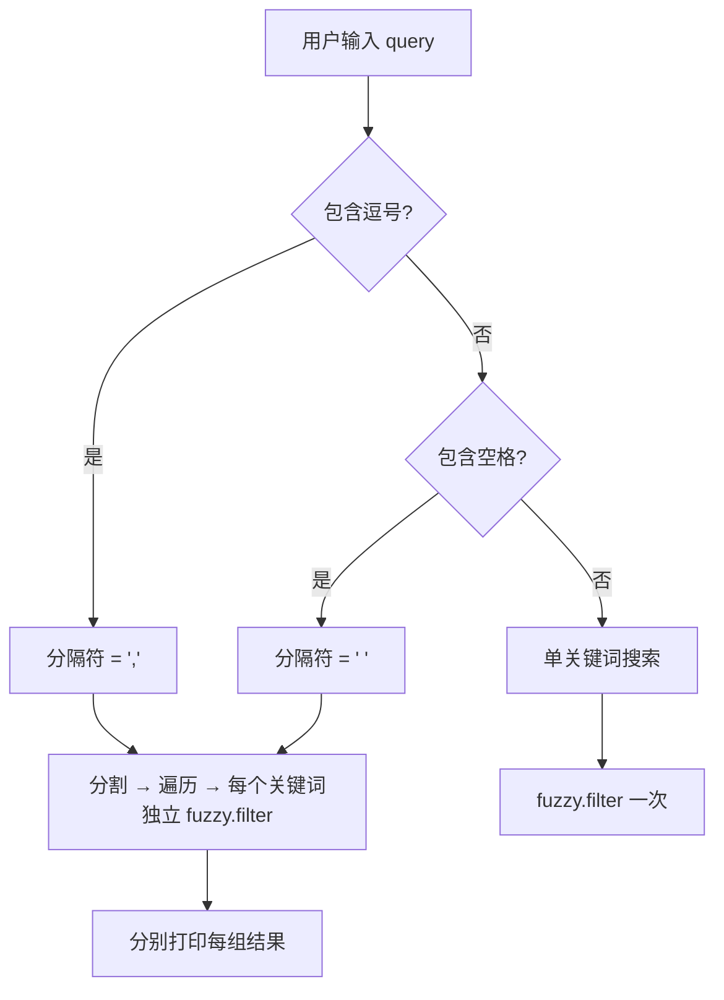

# 搜索引擎实现

`search` 命令是 licon 的查询中枢，它将文件系统中的 Lucide 图标元数据转化为内存中的可搜索索引，再通过模糊匹配引擎返回结果。其核心架构是一个 **三段式流水线**：缓存索引构建 → 查询解析路由 → 模糊匹配排序。本文将深入分析每一阶段的实现权衡与设计意图。

## 模块级缓存：惰性初始化的永久索引

```typescript
let cachedIconList: any[] | null = null;
```

`cachedIconList` 是一个模块作用域的 `let` 变量，挂载在 `search.ts` 的模块闭包中。这意味着：

- **生命周期 = 进程生命周期**。一旦首次构建，缓存在进程退出前永不释放（除非手动调用 `clearSearchCache`）。
- **跨多次调用共享**。连续执行 `licon search a` → `licon search b` 不会重复读取文件系统——如果运行在同一个 Node.js 进程内。
- **非线程安全但无竞态**。Node.js 单线程模型使得这种同步读写天然安全。

对于 CLI 工具而言，这种"永久缓存"策略是合理的——进程通常短暂存在，缓存命中率接近 100%（连续搜索场景）。但它与传统的 LRU/TTL 缓存不同，**没有任何自动失效机制**。

[来源](src/commands/search.ts#L7-L7)

## getIconList：从文件系统到搜索索引

`getIconList` 是流水线的第一阶段，负责将磁盘上的 JSON 元数据转换为内存中的搜索对象数组。

```typescript
function getIconList(config: Config): any[] {
  if (cachedIconList) return cachedIconList;

  const iconsDir = config.iconsDir || path.join(config.repoPath, 'icons');
  const jsonFiles = fs.readdirSync(iconsDir).filter(f => f.endsWith('.json'));

  cachedIconList = jsonFiles.map(f => {
    const name = f.replace('.json', '');
    const meta = JSON.parse(fs.readFileSync(path.join(iconsDir, f), 'utf-8'));
    const cats = meta.categories ? meta.categories.join(', ') : '';
    const tags = meta.tags ? meta.tags.join(', ') : '';
    return { name, cats, tags, searchText: `${name} ${cats} ${tags}` };
  });

  return cachedIconList;
}
```

关键设计决策在于 **`searchText` 的拼接策略**：

```
searchText = "${name} ${cats} ${tags}"
```

- **Lucide 图标 JSON 元数据**中，`categories` 和 `tags` 是字符串数组（如 `["arrows", "navigation"]`），被 `.join(', ')` 拍平成逗号分隔字符串。
- 三个维度（名称、分类、标签）被无分隔符地拼入同一个字符串。这意味着搜索"arrow navigation"可能匹配到名为"arrow"的图标（分类为"navigation"），也可能匹配到名为"navigation-arrow"的图标。
- **这是典型的"扁平搜索空间"设计**：牺牲了字段级搜索精度（无法指定"只在分类中搜索"），换来了模糊匹配的简单性和覆盖面。fuzzy 库无需理解数据结构，只需对一个字符串做字符级匹配。

每个图标对象保留 `name`、`cats`、`tags` 的原始结构，供后续的 verbose 输出使用。

[来源](src/commands/search.ts#L9-L25)

## 查询路由：三类解析逻辑

`searchCommand` 函数中有三个分支，由 `hasComma` 和 `hasSpace` 两个布尔变量驱动：

```typescript
const hasComma = query.includes(',');
const hasSpace = query.includes(' ');

if (hasComma || hasSpace) {
  const sep = hasComma ? ',' : ' ';
  // ... 多关键词分支
  return;
}
// ... 单关键词分支
```

### 分支设计时序图



### 分支一：单关键词（无逗号、无空格）

对 `iconList` 执行一次 `fuzzy.filter`，结果按分数降序排列，取 `limit` 条输出。这是最常用的路径，性能最优——`O(n)` 遍历整个列表。

### 分支二：逗号分隔多查询

当查询包含逗号时（如 `"arrow, heart, star"`），`hasComma` 为 `true`，分隔符确定为逗号。**注意 `hasComma` 的优先级高于 `hasSpace`**——这意味着 `"a, b c"` 会被按逗号分割成 `["a", "b c"]`，而非按空格分割。

分割后，对每个关键词独立执行 `fuzzy.filter`，结果用 `---` 分隔输出。这种设计意图是支持 **批量查询**：用户一次输入多个关键词，获取各自的前 N 个结果，而非对多关键词做 AND 交集。

### 分支三：空格分隔多查询

逻辑与逗号分支完全一致，只是分隔符不同。但有一个微妙的行为：**如果查询同时包含逗号和空格，逗号优先**。只有在查询完全不包含逗号时，空格才会被当作分隔符。

### 语义陷阱：OR 而非 AND

这是一个重要的设计选择——多关键词查询是 **OR 语义**（每个关键词独立搜索并输出），而非 AND 语义（结果必须匹配所有关键词）。这意味着 `licon search arrow right` 不会返回同时匹配"arrow"和"right"的图标，而是分别展示两组结果。这在 [快速开始](快速开始.md) 中可能被用户误解为 AND 查询，需要留意。

[来源](src/commands/search.ts#L28-L70)

## fuzzy.filter 与 extract 回调

`fuzzy` 库（v0.1.3）的核心是 `fuzzy.filter(pattern, arr, opts)` 函数。它的工作原理：

1. 遍历 `arr` 的每个元素
2. 如果提供了 `opts.extract`，用它从元素中提取待匹配字符串；否则直接使用元素本身（假设是字符串）
3. 用 `fuzzy.match(pattern, str, opts)` 做**字符级顺序匹配**：遍历 `str` 的每个字符，按顺序匹配 `pattern` 的每个字符
4. 匹配到的字符用 `opts.pre` 和 `opts.post` 包裹（默认空字符串，即不包裹）
5. 计算分数：连续匹配字符越多，分数呈超线性增长（`currScore += 1 + currScore`）；精确匹配时分数为 `Infinity`
6. 返回数组按分数降序排列，同分时按原始索引升序（保证稳定排序）

在 licon 中的使用：

```typescript
const results = fuzzy.filter(query, iconList, {
  extract: (item) => item.searchText
}) as any[];
```

`extract` 回调从图标对象中提取 `searchText` 属性，fuzzy 内部将其转为小写（默认 `caseSensitive: false`）后执行字符级顺序匹配。这意味着：

- 搜索 "hrt" 能匹配到 "heart"（h→e→a→r→t，字符顺序匹配）
- 搜索 "th" 也能匹配到 "heart"（h→e→a→r→t 中的 h...t）
- 搜索 "rht" 无法匹配 "heart"（顺序不对：h 在 r 之后出现）

这种模糊匹配机制对图标名称搜索非常友好——用户不需要知道准确拼写，输入子序列即可。

[来源](node_modules/fuzzy/lib/fuzzy.js#L82-L124)

## 缓存失效：未被调用的逃生舱

`search.ts` 导出了 `clearSearchCache` 函数：

```typescript
export function clearSearchCache() {
  cachedIconList = null;
}
```

但在整个代码库中，**没有任何地方调用它**。这与 `get.ts` 中的 `clearGetCache` 情况相同——两个清除函数都存在但未被使用。

对于 CLI 工具，这意味着：
- 在单次进程调用中（如 `licon search foo`），缓存构建后永不失效——没问题
- 如果 licon 被作为长时间运行的库嵌入（如 AI Agent 场景），且 lucide 仓库在运行时被更新（通过 `upgrade` 命令），**搜索缓存不会感知到变化**，返回的仍是旧数据

这是一个**已知但当前未触发的边界情况**。如果未来需要支持"搜索前自动升级"功能，必须在升级后调用 `clearSearchCache()`。

[来源](src/commands/search.ts#L88-L90)

## searchText 设计的局限与权衡

`searchText` 的扁平拼接策略是理解整个搜索引擎的关键。其权衡如下：

| 维度 | 优势 | 劣势 |
|------|------|------|
| **覆盖度** | 名称、分类、标签三个维度全部可搜 | 维度间无隔离，不同字段的词汇可能交叉污染 |
| **性能** | 单字符串匹配，fuzzy 库无需理解结构 | 无法做字段加权（名称匹配应比标签匹配得分更高） |
| **精确性** | 简单直观 | 无法排除误匹配（如分类名"arrows"匹配到标签中的"arrow"相关词） |

一个可能的改进方向是使用多字段加权评分：对名称匹配赋予更高权重，其次是分类，最后是标签。但当前的扁平设计在 icon 搜索场景中已经足够——用户通常凭名称或分类的模糊记忆来搜索，少有需要精确字段过滤的需求。

## 与交互模式的对比

[交互模式](交互模式.md) (`interactive.ts`) 使用了完全相同的 `searchText` 拼接逻辑和 `fuzzy.filter` 调用方式，但**没有使用缓存**——每次进入交互模式都重新读取所有 JSON 文件。这是因为交互模式是长时间运行的循环，需要确保数据新鲜度，而 `searchCommand` 是一次性调用，缓存带来的性能收益更大。

[来源](src/commands/interactive.ts#L18-L26)

## 下一步

- 查看 [配置系统](配置系统.md) 理解 `Config` 接口中的 `iconsDir` 和 `repoPath` 如何被解析
- 了解 [SVG 读取与元数据缓存](svg-读取与元数据缓存.md) 中 `get.ts` 如何实现另一套缓存策略（Map 结构+惰性加载）
- 查看 [AI Agent 集成](ai-agent-集成.md) 中 SKILL.md 如何定义搜索命令的使用规则