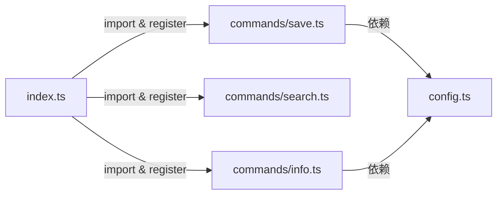

# 添加新命令

licon 的模块化架构使添加新命令只需三步：创建命令文件 → 实现导出函数 → 在入口注册。整套流程可在 5 分钟内完成，无需改动现有代码。

---

## 架构全景

每个命令在项目中承担三个角色：

| 层次 | 文件 | 职责 |
|------|------|------|
| **定义** | `src/commands/<name>.ts` | 导出 `xxxCommand` 函数，含核心逻辑 |
| **注册** | `src/index.ts` | 用 Commander.js 链式 API 挂载命令 |
| **配置** | `src/config.ts` | 提供 `Config` 类型和 `getConfig()` |

关系如下：



[来源](src/index.ts#L1-L82), [来源](src/config.ts#L1-L35)

---

## 第一步：创建命令文件

在 `src/commands/` 下新建文件，以 `info.ts` 为例——它负责显示单个图标的完整详情（名称、分类、标签、SVG 内容）。

```typescript
// src/commands/info.ts
import fs from 'fs';
import path from 'path';
import { Config } from '../config.js';
import { ensureSetup } from './setup.js';

export function infoCommand(name: string, options: {}, config: Config) {
  // 1. 配置检查
  if (!config.repoPath) {
    if (!ensureSetup()) {
      return;
    }
  }

  const iconsDir = config.iconsDir || path.join(config.repoPath, 'icons');
  const svgPath = path.join(iconsDir, `${name}.svg`);
  const jsonPath = path.join(iconsDir, `${name}.json`);

  // 2. 验证图标存在
  if (!fs.existsSync(svgPath)) {
    console.error(`Icon "${name}" not found.`);
    process.exit(1);
  }

  // 3. 读取 SVG
  const svg = fs.readFileSync(svgPath, 'utf-8');

  // 4. 读取元数据（可选）
  let categories = '';
  let tags = '';
  if (fs.existsSync(jsonPath)) {
    const meta = JSON.parse(fs.readFileSync(jsonPath, 'utf-8'));
    categories = meta.categories ? meta.categories.join(', ') : '';
    tags = meta.tags ? meta.tags.join(', ') : '';
  }

  // 5. 输出详情
  console.log(`Icon: ${name}`);
  console.log(`Categories: ${categories || '(none)'}`);
  console.log(`Tags: ${tags || '(none)'}`);
  console.log('--- SVG ---');
  console.log(svg);
}
```

### 函数签名约定

所有命令函数遵循相同模式：

```
export function <commandName>(<params>, options: <OptionsType>, config: Config)
```

- **位置参数**：放在前面，对应 Commander 的 `<arg>` 占位符。没有位置参数时（如 `list`、`upgrade`）可省略。
- **options 对象**：第二个参数，对应 `--flag` 选项。类型用接口定义，所有字段可选。
- **config**：始终是最后一个参数，类型为 `Config`。

现有命令的签名一览：

| 命令 | 签名 | 来源 |
|------|------|------|
| `get` | `(names: string[], options: { format?: string }, config)` | [来源](src/commands/get.ts#L42-L43) |
| `save` | `(name: string, options: { output?: string }, config)` | [来源](src/commands/save.ts#L6-L7) |
| `search` | `(query: string, options: { limit?: number; verbose?: boolean }, config)` | [来源](src/commands/search.ts#L28-L29) |
| `cat` | `(category: string, options: void, config)` | [来源](src/commands/cat.ts#L6-L7) |
| `list` | `(config)` | [来源](src/commands/list.ts#L6-L7) |
| `convert` | `(name: string, options: { format?: string; output?: string }, config)` | [来源](src/commands/convert.ts#L12-L13) |

### 配置守卫

**`ensureSetup()`** 是所有需要 repo 路径的命令的标配。如果用户未运行 `licon setup`，它会输出提示并返回 `false`，让函数中止。

```typescript
if (!config.repoPath) {
  if (!ensureSetup()) {
    return;
  }
}
```

[来源](src/commands/setup.ts#L67-L72), [来源](src/commands/save.ts#L8-L12)

---

## 第二步：在 index.ts 中注册

打开 `src/index.ts`，依次完成三步。

### 2.1 导入模块

在文件顶部的 import 区域追加：

```typescript
import { infoCommand } from './commands/info.js';
```

> **注意**：虽然源文件是 `.ts`，但 import 路径必须写 `.js` 扩展名——这是 ESM 约定，TypeScript 编译后路径不变。

### 2.2 调用 program.command 链

在现有命令注册块之后（`upgradeCommand` 之前或之后均可）添加：

```typescript
program
  .command('info <name>')
  .description('Show detailed information about an icon')
  .action((name) => {
    const config = getConfig();
    infoCommand(name, {}, config);
  });
```

### 2.3 添加选项（可选）

如果命令需要 `--flag` 选项，在 `.description()` 之后链式调用 `.option()`：

```typescript
program
  .command('info <name>')
  .description('Show detailed information about an icon')
  .option('-s, --svg-only', 'Show only the SVG code')
  .action((name, options) => {
    const config = getConfig();
    infoCommand(name, options, config);
  });
```

![注册流程]

```
index.ts 中的注册 ↔ 命令函数签名的对应关系：

Commander          函数参数
─────────────────────────────────
<name>         →   name: string
<names...>     →   names: string[]
--format <t>   →   options.format
--output <p>   →   options.output
--verbose      →   options.verbose
```

[来源](src/index.ts#L28-L36)

---

## 完整案例：info 命令

将以上两步组合，从零到可运行的完整文件内容如下。

### src/commands/info.ts

```typescript
import fs from 'fs';
import path from 'path';
import { Config } from '../config.js';
import { ensureSetup } from './setup.js';

export function infoCommand(name: string, options: { svgOnly?: boolean }, config: Config) {
  if (!config.repoPath) {
    if (!ensureSetup()) {
      return;
    }
  }

  const iconsDir = config.iconsDir || path.join(config.repoPath, 'icons');
  const svgPath = path.join(iconsDir, `${name}.svg`);
  const jsonPath = path.join(iconsDir, `${name}.json`);

  if (!fs.existsSync(svgPath)) {
    console.error(`Icon "${name}" not found.`);
    process.exit(1);
  }

  const svg = fs.readFileSync(svgPath, 'utf-8');

  if (options.svgOnly) {
    console.log(svg);
    return;
  }

  let categories = '';
  let tags = '';
  if (fs.existsSync(jsonPath)) {
    const meta = JSON.parse(fs.readFileSync(jsonPath, 'utf-8'));
    categories = meta.categories ? meta.categories.join(', ') : '';
    tags = meta.tags ? meta.tags.join(', ') : '';
  }

  console.log(`Icon: ${name}`);
  console.log(`Categories: ${categories || '(none)'}`);
  console.log(`Tags: ${tags || '(none)'}`);
  console.log('--- SVG (' + svg.length + ' bytes) ---');
  console.log(svg);
}
```

### src/index.ts 中的注册代码

```typescript
import { infoCommand } from './commands/info.js';

// ... 在 upgrade 注册之后
program
  .command('info <name>')
  .description('Show detailed information about an icon')
  .option('-s, --svg-only', 'Show only the SVG code')
  .action((name, options) => {
    const config = getConfig();
    infoCommand(name, options, config);
  });
```

运行结果：

```bash
$ licon info heart
Icon: heart
Categories: medical, shapes
Tags: love, heart, like
--- SVG (402 bytes) ---
<svg ...>...</svg>

$ licon info heart --svg-only
<svg ...>...</svg>
```

---

## 高级模式

### 异步命令

如果命令涉及异步操作（如 `convert` 调用 sharp、`interactive` 使用 readline 循环），函数声明 `async`，action 回调也要 `async`：

```typescript
// index.ts
program
  .command('convert <name>')
  .action(async (name, options) => {
    const config = getConfig();
    await convertCommand(name, options, config);
  });
```

[来源](src/index.ts#L55-L59)

### 内联命令

对于极简命令（如 `categories`），可以不创建独立文件，直接在 action 回调中编写逻辑，但这会破坏模块化原则，建议仅在 5 行以内的逻辑时使用。

[来源](src/index.ts#L69-L83)

### 缓存管理

如果命令内建了缓存（如 `get.ts` 中的 `cachedIconMeta`、`search.ts` 中的 `cachedIconList`），务必导出 `clear<Name>Cache()` 函数，供测试或 `upgrade` 后重置：

```typescript
export function clearGetCache() {
  cachedIconMeta = null;
}
```

[来源](src/commands/get.ts#L75-L77), [来源](src/commands/search.ts#L88-L90)

### 错误退出

使用 `process.exit(1)` 而非 throw Error，避免打印冗长的调用栈：

```typescript
console.error(`Icon "${name}" not found.`);
process.exit(1);
```

[来源](src/commands/save.ts#L14-L15)

---

## 验证清单

完成添加后，确认以下事项：

1. **编译通过**：`npm run build`（即 `tsc`）无错误
2. **`--help` 显示**：`licon --help` 中出现了新命令的名称和描述
3. **配置守卫**：未配置时调用新命令，输出的是 `ensureSetup()` 的友好提示而非崩溃
4. **边界情况**：空参数、不存在的图标名、特殊字符名称均给出有意义的错误信息

---

## 下一步

- 了解 [命令注册与调度](命令注册与调度.md) 中 program.parse 和自动跳转逻辑
- 熟悉 [配置系统](配置系统.md) 中 Config 接口的完整字段
- 阅读 [搜索引擎实现](搜索引擎实现.md) 理解 fuzzy 缓存模式，可复用于新命令的搜索功能
- 查看 [保存与转换](保存与转换.md) 中 save 命令的完整实现作为参考模板