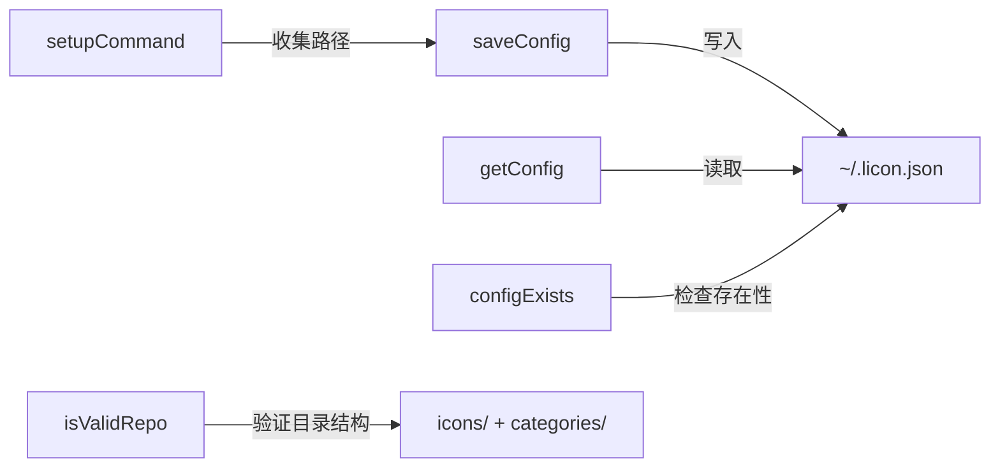
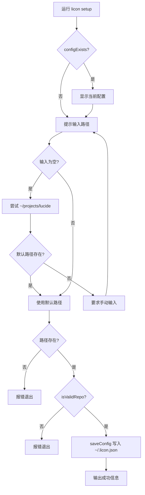
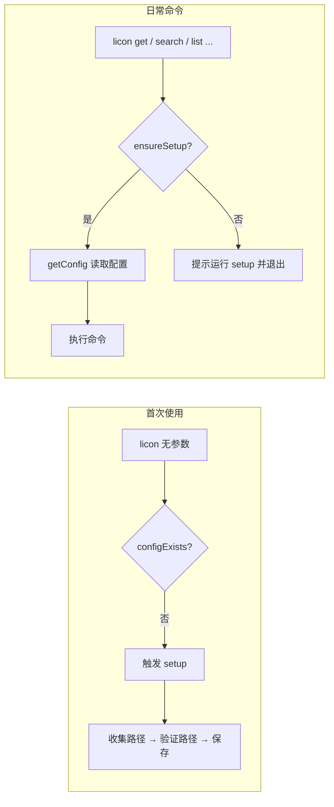

配置系统是 licon 的"前提条件"模块。它管理 **本地 Lucide 仓库路径** 的持久化、读取和验证，**所有需要访问图标的命令** 都依赖它来判断是否可以继续执行。

---

## 配置存储位置与结构

配置文件固定存储在用户目录下的 `.licon.json`：

```
~/.licon.json
```

文件内容是一个简单的 JSON 对象，包含两个字段：

```json
{
  "repoPath": "/Users/username/projects/lucide",
  "iconsDir": "/Users/username/projects/lucide/icons"
}
```

- **`repoPath`**：用户克隆的 [lucide](https://github.com/lucide-icons/lucide) 仓库根目录。
- **`iconsDir`**：SVG 图标存放的子目录，由 `repoPath + '/icons'` 自动派生。

[来源](src/config.ts#L7-L10)

---

## Config 接口

```typescript
export interface Config {
  repoPath: string;
  iconsDir: string;
}
```

这是整个 CLI 中传递配置的契约。几乎所有命令的 action 函数都会先调用 `getConfig()` 拿到 Config 对象，再传入具体的命令处理函数（如 `getCommand(names, options, config)`）。`iconsDir` 提供冗余信息以减少命令侧的路径拼接逻辑。

[来源](src/config.ts#L7-L10)

---

## 五个核心函数及其职责

### `getConfig()` — 读取配置

从 `~/.licon.json` 读取并解析。若文件不存在，返回空配置（`repoPath: ''`, `iconsDir: ''`），而非抛出异常。这种"静默降级"的设计让无配置时的错误处理统一交给命令侧的 `ensureSetup()`。

```typescript
export function getConfig(): Config {
  if (!fs.existsSync(CONFIG_PATH)) {
    return { repoPath: '', iconsDir: '' };
  }
  const data = JSON.parse(fs.readFileSync(CONFIG_PATH, 'utf-8'));
  return {
    repoPath: data.repoPath || '',
    iconsDir: data.iconsDir || path.join(data.repoPath, 'icons')
  };
}
```

读取时若 JSON 中缺少 `iconsDir`，会自动从 `repoPath` 拼接生成，保证向后兼容。

[来源](src/config.ts#L12-L19)

### `saveConfig(repoPath)` — 保存配置

接收用户提供的仓库路径，自动拼接 `iconsDir`，写入 `~/.licon.json`，并返回新 Config 对象。

```typescript
export function saveConfig(repoPath: string): Config {
  const config = {
    repoPath,
    iconsDir: path.join(repoPath, 'icons')
  };
  fs.writeFileSync(CONFIG_PATH, JSON.stringify(config, null, 2));
  return config;
}
```

[来源](src/config.ts#L21-L28)

### `configExists()` — 检查配置是否存在

最简单的守卫函数，仅检查配置文件在磁盘上是否存在。比调用 `getConfig()` 再判断 `repoPath` 是否为空更轻量。

```typescript
export function configExists(): boolean {
  return fs.existsSync(CONFIG_PATH);
}
```

[来源](src/config.ts#L30-L32)

### `isValidRepo(repoPath)` — 验证仓库结构

验证目录下同时存在 `icons/` 和 `categories/` 两个子目录。这是 Lucide 仓库的必要结构特征，缺少任何一个都意味着路径指向的不是 Lucide 仓库。

```typescript
export function isValidRepo(repoPath: string): boolean {
  return fs.existsSync(path.join(repoPath, 'icons')) &&
         fs.existsSync(path.join(repoPath, 'categories'));
}
```

[来源](src/config.ts#L34-L37)

### `getConfigPath()` — 获取配置文件路径

返回硬编码的 `CONFIG_PATH` 常量，供需要直接操作文件（如输出提示信息）的场景使用。

```typescript
export function getConfigPath(): string {
  return CONFIG_PATH;
}
```

[来源](src/config.ts#L39-L41)

五个函数的关系如下：



---

## `setup` 命令：交互式配置流程

`licon setup` 是用户配置路径的入口。它读取用户输入，验证路径，最后持久化。流程如下：



关键验证点：

1. **路径存在性** — 检查 `fs.existsSync(repoPath)`。若路径不存在，直接退出。
2. **仓库有效性** — 调用 `isValidRepo()` 确认 `icons/` 和 `categories/` 同时存在。缺少任何一个目录都提示"不是有效的 Lucide 仓库"并退出。

[来源](src/commands/setup.ts#L9-L65)

---

## `ensureSetup`：所有命令的前置守卫

**`ensureSetup()`** 是连接配置系统与各命令执行系统之间的守卫函数，定义在 `src/commands/setup.ts` 中：

```typescript
export function ensureSetup(): boolean {
  if (configExists()) {
    return true;
  }
  console.log('❌ Configuration not found. Please run: licon setup');
  return false;
}
```

它在其余所有命令（`get`、`save`、`search`、`list`、`cat`、`convert`、`upgrade`、`interactive`）的执行路径起点被调用。若返回 `false`，前面的命令立即终止。

```typescript
// 每个命令入口的一致模式
import { ensureSetup } from './setup.js';

if (!ensureSetup()) {
  return;  // 或 process.exit(1)
}
const config = getConfig();
// ... 继续执行命令主体
```

这种设计将"配置是否就绪"的检查从各个命令中抽离，形成一个统一的**前置断言**。任何新增命令只需要在开头调用一次 `ensureSetup()` 即可复用这套守卫逻辑。参见 [添加新命令](添加新命令.md)。

[来源](src/commands/setup.ts#L67-L73)

无参数运行 `licon` 时，若 `configExists()` 为 `false`，也会自动触发 `setupCommand()`，引导用户完成首次配置：

```typescript
if (!configExists()) {
  console.log('🔧 First time setup required.\n');
  setupCommand();
}
```

[来源](src/index.ts#L119-L121)

---

## 配置流程全景



---

## 下一步

- 了解各命令如何使用配置来访问图标源文件：[搜索图标](搜索图标.md)、[获取 SVG](获取-svg.md)、[保存与转换](保存与转换.md)
- 查看所有命令的注册与守卫调用方式：[命令注册与调度](命令注册与调度.md)
- 向 CLI 添加新命令时如何遵循这套模式：[添加新命令](添加新命令.md)